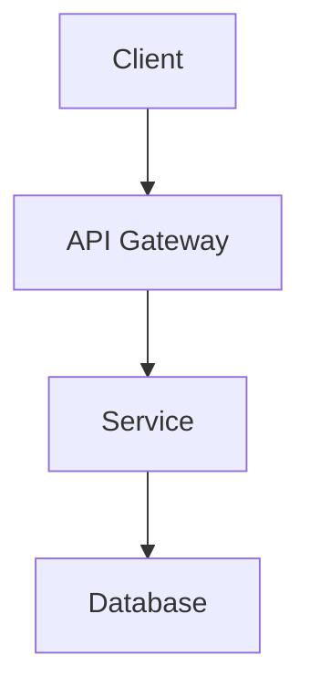

# Product Requirements Document — Template

> Copy this template and fill in all sections. Remove this instruction block when done.

---

# [Product/Feature Name] — Product Requirements Document

**Author**: @pm
**Date**: YYYY-MM-DD
**Version**: 1.0
**Status**: Draft | In Review | Approved

---

## 1. Executive Summary

Brief overview of the product/feature, its purpose, and the problem it solves.

## 2. Problem Statement

What problem does this solve? Who is affected? What is the impact of not solving it?

## 3. Goals & Objectives

| # | Goal | Success Metric |
|---|------|---------------|
| 1 | ... | ... |
| 2 | ... | ... |

## 4. Non-Goals

What is explicitly **out of scope** for this iteration?

- ...
- ...

## 5. Target Users

| Persona | Description | Key Need |
|---------|------------|----------|
| ... | ... | ... |

## 6. User Stories

### Epic: [Epic Name]

- **US-001**: As a [role], I want [capability] so that [benefit].
  - Acceptance Criteria:
    - [ ] ...
    - [ ] ...

- **US-002**: As a [role], I want [capability] so that [benefit].
  - Acceptance Criteria:
    - [ ] ...

## 7. Functional Requirements

| ID | Requirement | Priority | Notes |
|----|------------|----------|-------|
| FR-001 | ... | Must-have | ... |
| FR-002 | ... | Should-have | ... |
| FR-003 | ... | Nice-to-have | ... |

## 8. Non-Functional Requirements

| Category | Requirement |
|----------|------------|
| Performance | ... |
| Scalability | ... |
| Security | ... |
| Availability | ... |
| Accessibility | ... |

## 9. Technical Constraints

- Language/Framework: ...
- Infrastructure: ...
- Third-party dependencies: ...
- Regulatory/Compliance: ...

## 10. Proposed Tech Stack

| Layer | Technology | Rationale |
|-------|-----------|-----------|
| Frontend | ... | ... |
| Backend | ... | ... |
| Database | ... | ... |
| Infrastructure | ... | ... |
| CI/CD | ... | ... |

## 11. Architecture Overview

> Include a high-level architecture diagram (Mermaid or image).

## 12. Milestones & Timeline

| Phase | Deliverable | Target Date | Owner |
|-------|------------|-------------|-------|
| 1 | MVP | ... | @engineer |
| 2 | Testing | ... | @devsecops |
| 3 | Deployment | ... | @cloudengineer |

## 13. Risks & Mitigations

| Risk | Impact | Probability | Mitigation |
|------|--------|-------------|------------|
| ... | High/Med/Low | High/Med/Low | ... |

## 14. Open Questions

- [ ] ...
- [ ] ...

## 15. Approval

| Role | Name/Handle | Status | Date |
|------|------------|--------|------|
| Product Manager | @pm | Pending | ... |
| Architect | @architect | Pending | ... |
| User | — | Pending | ... |
